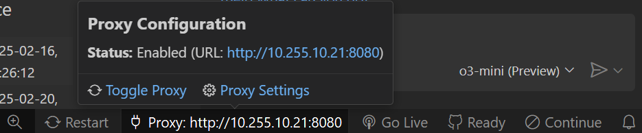

  <h1 align="center">otak-proxy</h1>
  
One-click proxy configuration for OS, VSCode, and Git.

---

Simply click to enable/disable proxy settings across your entire system and development tools.

## Features

- One-click proxy configuration for:
  - OS system proxy
  - VSCode proxy
  - Git proxy settings
- Visual status indicator in status bar
- Easy initial setup

## Usage

1. Click the proxy icon in the status bar to toggle
2. Or use the command palette (F1): "Toggle Proxy Settings"

Status bar shows:
-  Proxy: On - Shows current proxy URL
-  Proxy: Off - Click to enable

## OS Support

- Windows: Configures WinHTTP proxy
- macOS: Sets network service proxy
- Linux: Updates GNOME proxy settings

## Requirements

- Visual Studio Code 1.9.0 or higher
- Git
- Admin rights (for system proxy configuration)

## Extension Settings

* `otakProxy.proxyUrl`: Proxy server URL (e.g., `http://proxy.example.com:8080`)

## Troubleshooting

If proxy settings fail to update:
1. Check proxy URL format
2. Verify admin privileges
3. Ensure Git is installed

## License

MIT License - see the LICENSE file for details.

---

For more information, visit the [GitHub repository](https://github.com/tsuyoshi-otake-system-exe-jp/otak-proxy).